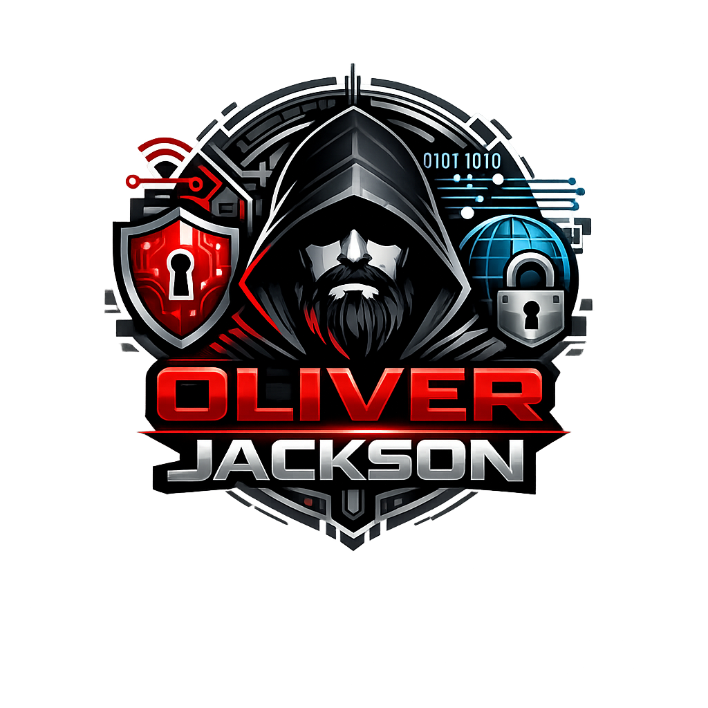

  

<h1 align="center">Oliver Jackson</h1>

  <b>Cybersecurity Enthusiast • SOC Analyst in Training • IT Student</b>

  <i>Defending systems by day, breaking my own labs by night.</i>

---

 🧠 About Me

Hi 👋 I’m Oliver — an IT student with a deep interest in **cybersecurity and SOC operations**.

I enjoy:
- 🔍 Investigating suspicious logs like a digital detective  
- 🚨 Learning how attackers think (so I can ruin their day)
- 🧪 Building hands-on security labs instead of just reading slides

Currently focused on:
- Blue Team fundamentals  
- SIEM & log analysis  
- Malware behavior (yes, including trojans 👀)

> I believe security is not about tools — it’s about mindset, curiosity, and asking “what could go wrong?”
---

 🛠️ Tech Stack & Tools

---

 📊 GitHub Activity

  

---

📫 Let’s Connect

- 💼 LinkedIn: *(add your link here)*  
- 🌐 Portfolio: *(if available)*  
- 📧 Email: *(optional)*  

> Always learning. Always building. Occasionally breaking things (on purpose).

